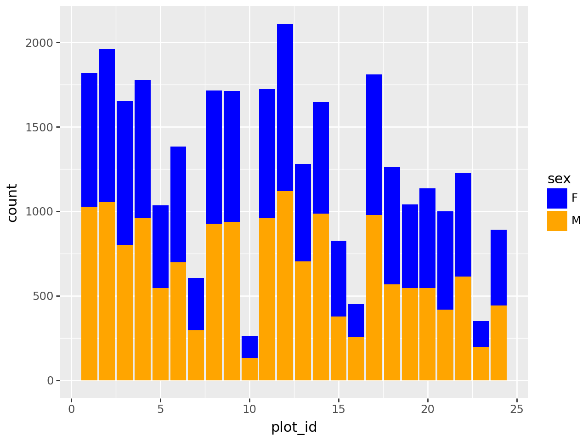
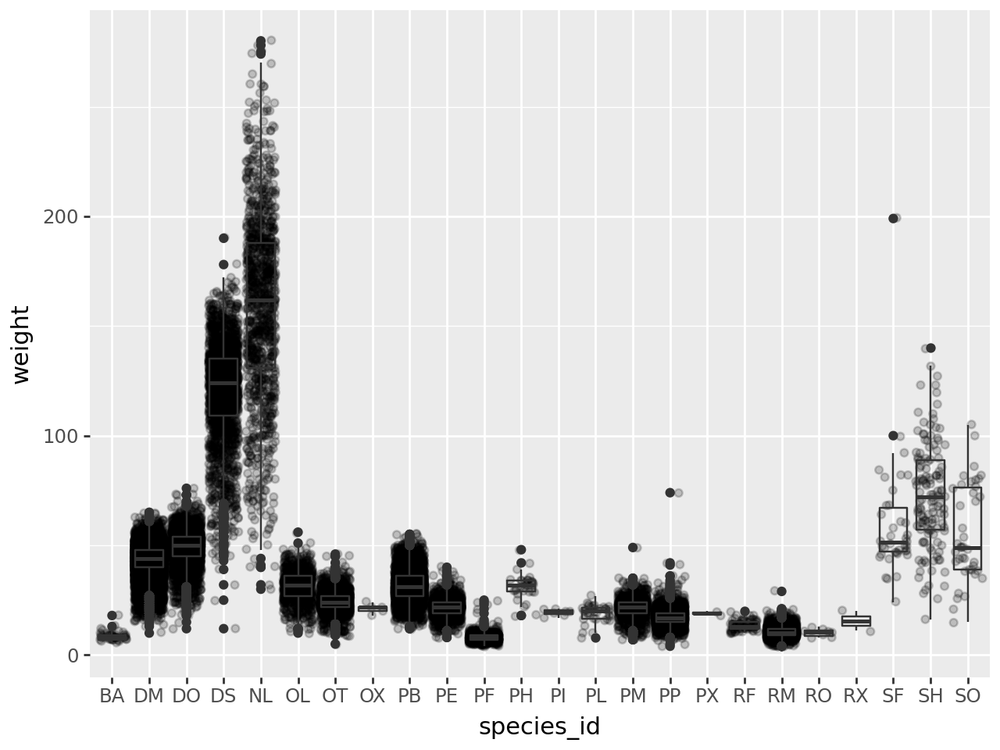
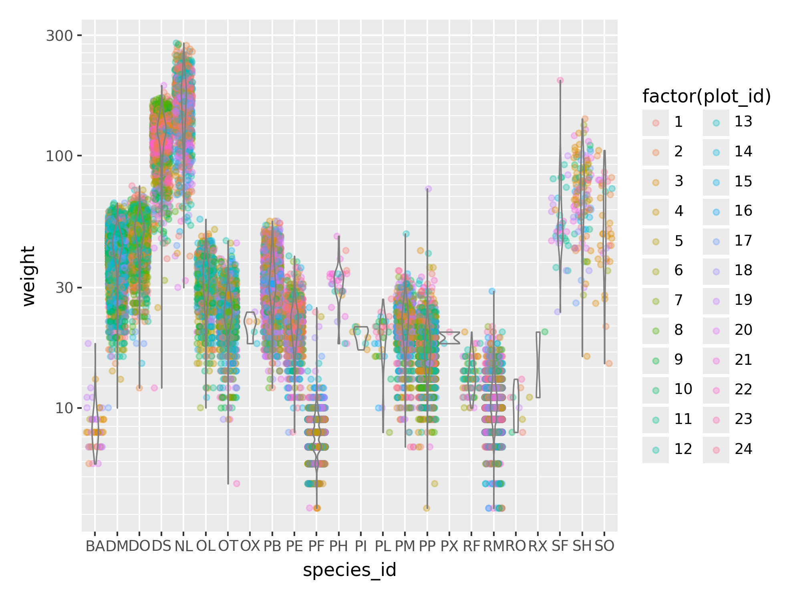
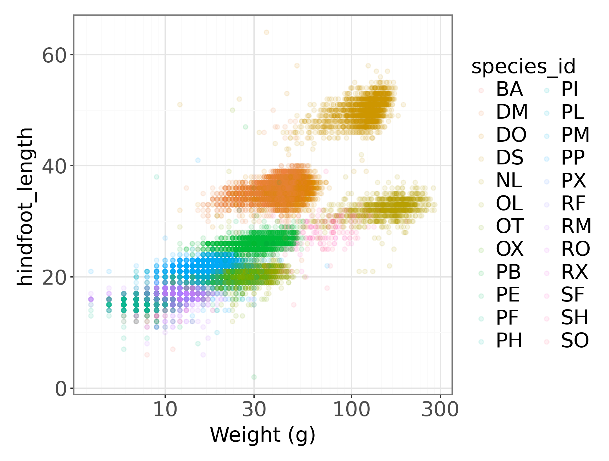
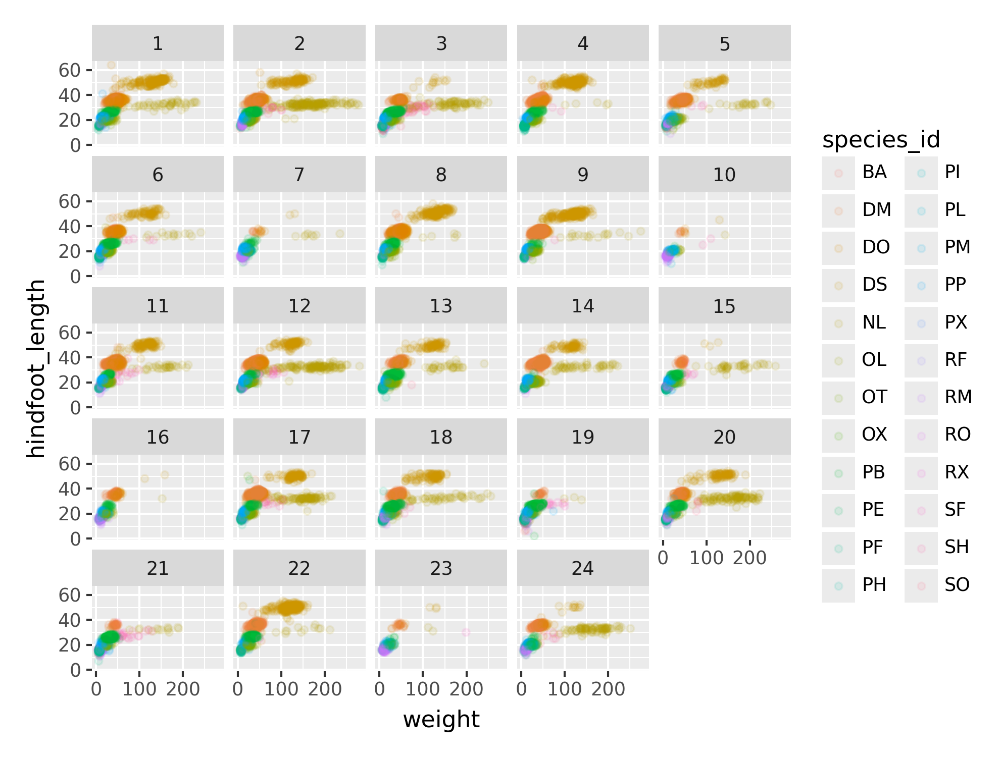

# Data Analysis and Visualization with Python
This repository contains exercises and projects completed as part of my Python Data Analysis and Visualization training offered through the BioDev Network training program.

***

## Skills Demonstrated

### Data Manipulation
- Loading and cleaning datasets
- Working with Pandas DataFrames
- Filtering and grouping data
- Calculating descriptive statistics

### Data Visualization
- Histograms
- Scatter plots
- Bar charts
- Box plots
- Customized figures using Matplotlib
- Grammar-of-graphics visualizations using Plotnine

### Database Analysis
- Connecting to SQLite databases
- Executing SQL queries from Python
- Importing query results into Pandas

### Environment Management
- Jupyter Notebook
- Miniconda environments
  
***

## Example Outputs

### Barplot

The barplot showed site-level counts (plot_id) grouped by sex, comparing male and female distributions across sampling sites.

### Boxplot

The boxplot showed the distribution of body weight across hindfoot length groups, with overlaid individual points to display number of measurements and their distributions.

### Violinplot

### Scatterplot

This scatterplot was used to investigate the relatioship between the weight vs. hindfoot length, colored by species to show inter-species variation.

